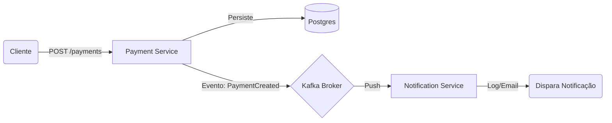

# ☕ Java Enterprise Challenges - 30 Days of Code

Este repositório documenta minha jornada de 30 dias dominando arquitetura corporativa moderna com Java, Spring Boot, Kafka e Docker. O objetivo é construir um ecossistema de microsserviços robusto e escalável.

## 🚀 Status do Progresso

| Dia | Desafio | Stack | Status |
|:---:|:---|:---|:---:|
| **01** | Payment Service (Producer) | Java 21, Spring Boot, Kafka | ✅ Concluído |
| **02** | Notification Service (Consumer) | Spring Boot, Kafka Listener, Docker | ✅ Concluído |
| **03** | Persistência Notification | JPA, H2, Repository | ✅ Concluído |
| **04** | Analytics API (Streams) | Java Streams, Records | ✅ Concluído |/' README.md
---

## 🏗️ Arquitetura Atual



## 🛠️ Tecnologias Utilizadas

* **Linguagem:** Java 21
* **Framework:** Spring Boot 3.2.4
* **Mensageria:** Apache Kafka (Confluent Image)
* **Banco de Dados:** PostgreSQL 15
* **Infraestrutura:** Docker & Docker Compose
* **Build:** Maven

---

## ▶️ Como Rodar o Projeto

### Pré-requisitos
* Docker & Docker Compose
* Java 21 (ou superior)
* Maven

### 1. Subir a Infraestrutura (Kafka, Zookeeper, Postgres)
```bash
docker compose up -d
```

### 2. Rodar o Payment Service (Porta 8080)
```bash
mvn -pl challenge-01-payment spring-boot:run
```

### 3. Rodar o Notification Service (Porta 8081)
```bash
mvn -pl challenge-02-notification spring-boot:run
```

### 4. Testar o Fluxo
Envie uma requisição para o microsserviço de pagamentos:

```bash
curl -X POST http://localhost:8080/api/v1/payments \
  -H "Content-Type: text/plain" \
  -d '{"amount": 1500.00, "currency": "BRL"}'
```

**Resultado esperado:**
O *Notification Service* deverá exibir no log:
> `📧 NOTIFICAÇÃO: Recebi um evento de pagamento! Conteúdo: {"amount": 1500.00, "currency": "BRL"}`

---

## 🤝 Contribuição
Sinta-se à vontade para abrir Issues ou Pull Requests para sugerir melhorias na arquitetura.

