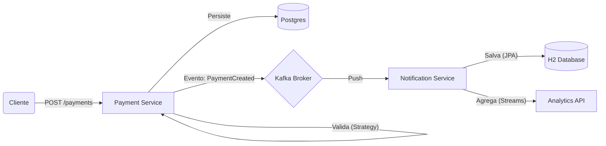

# ☕ Java Enterprise Challenges - 30 Days of Code

Este repositório documenta minha jornada de 30 dias dominando arquitetura corporativa moderna com Java, Spring Boot, Kafka e Docker. O objetivo é construir um ecossistema de microsserviços robusto e escalável.

## 🚀 Status do Progresso

| Dia | Desafio | Stack | Status |
|:---:|:---|:---|:---:|
| **01** | Payment Service (Producer) | Java 21, Spring Boot, Kafka | ✅ Concluído |
| **02** | Notification Service (Consumer) | Spring Boot, Kafka Listener, Docker | ✅ Concluído |
| **03** | Persistência Notification | JPA, H2, Repository | ✅ Concluído |
| **04** | Analytics API (Streams) | Java Streams, Records | ✅ Concluído |
| **05** | Strategy Pattern (Validação) | SOLID, Spring Beans | ✅ Concluído |
| 06 | ... | ... | ⏳ Pendente |

---

## 🏗️ Arquitetura Atual



## 🛠️ Tecnologias Utilizadas

* **Linguagem:** Java 21
* **Framework:** Spring Boot 3.2.4
* **Mensageria:** Apache Kafka (Confluent Image)
* **Banco de Dados:** PostgreSQL 15 & H2
* **Infraestrutura:** Docker & Docker Compose
* **Build:** Maven

## ▶️ Como Rodar o Projeto

### 1. Subir a Infraestrutura
```bash
docker compose up -d
```

### 2. Rodar os Serviços
```bash
mvn -pl challenge-01-payment spring-boot:run
mvn -pl challenge-02-notification spring-boot:run
```

